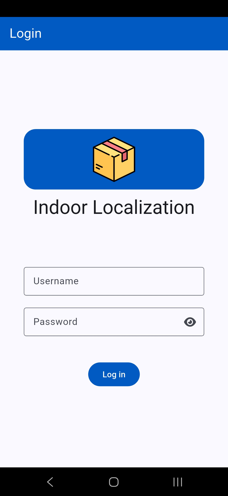
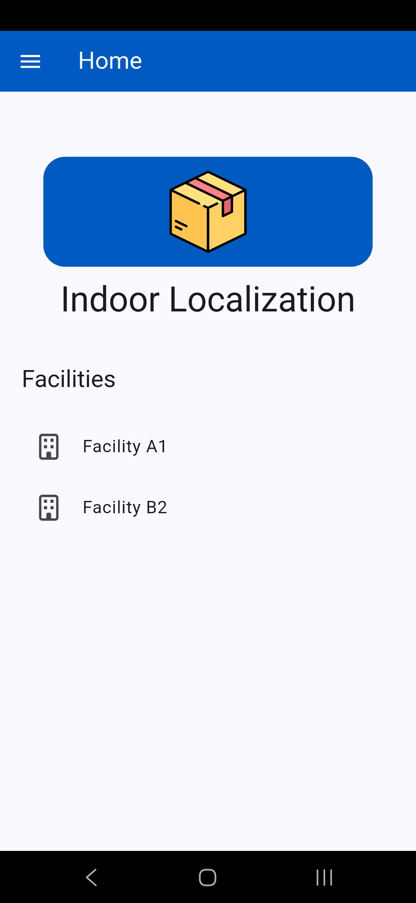
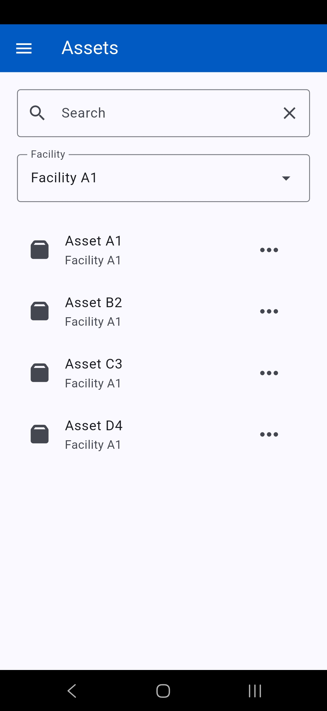
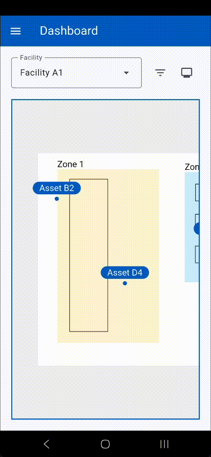
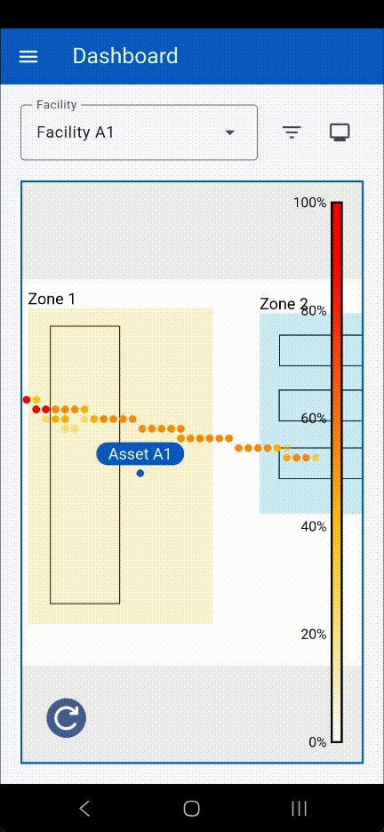
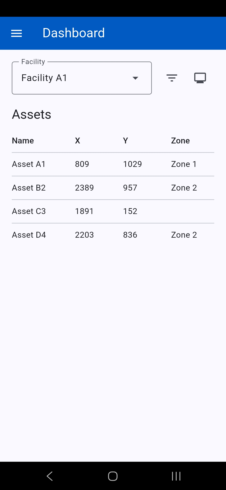
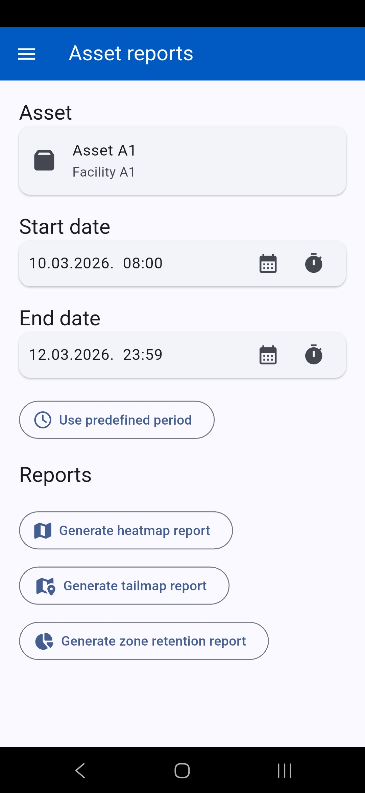
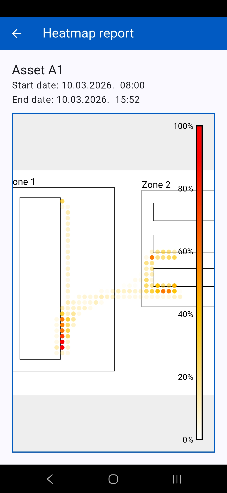
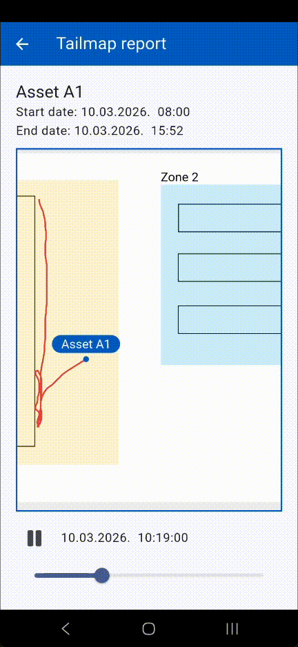
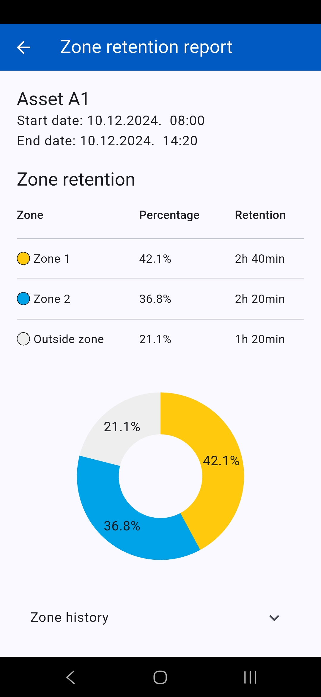

# Indoor Localization

## Overview

The **Indoor Localization** is a Flutter application
designed to track assets within a facility. The application
was developed in the Program analysis and development
coursse as a Work Based Learning project.
The application integrates with the backend server, but for a simpler demonstration, the actual web services have been replaced with virtual ones that returns mock data.

## Features
* Asset tracking within the facility in real time using MQTT
* Interactive facility map (zooming, panning)
* Overview of available assets
* Overview of asset movement reports
* Model-View-ViewModel architecture
* Modular design (different ways to display resources)

## Technology
* Flutter
* Supported platforms: Android, Windows (only for developing)

## Screens

### Login page

### Home page

### Assets overview

### Asset dashboard - position tracking

#### Display asset positions in real time on interactive map

#### Generate live asset heatmap 

#### Display asset positions in real time as a table

#### Asset reports

#### Generate report for specific asset and time period

#### Asset heatmap report

#### Asset tailmap report

#### Asset zone retention report

